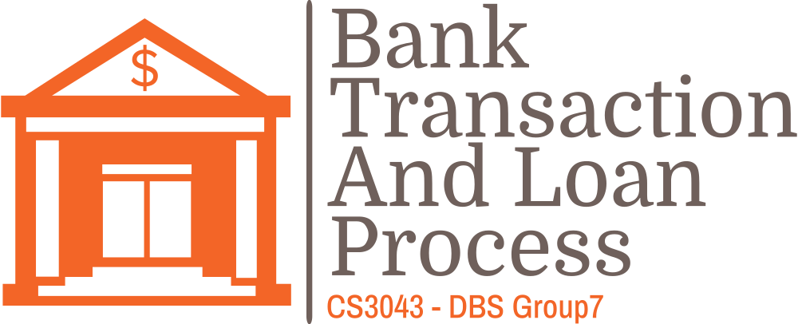

Backend code repository: https://github.com/Damika-Anupama/Bank-Transaction-And-Loan-Processing-System-Backend/tree/main

<a name="readme-top"></a>

[![Contributors][contributors-shield]][contributors-url]
[![Forks][forks-shield]][forks-url]
[![Stargazers][stars-shield]][stars-url]
[![Issues][issues-shield]][issues-url]
[![MIT License][license-shield]][license-url]


<!-- PROJECT LOGO -->
<br />
<div align="center">
  <a href="https://github.com/Damika-Anupama/Bank-Transaction-And-Loan-Processing-System-Frontend/">
    
  </a>

  <h3 align="center">Bank Transaction And Loan Processing System - Frontend</h3>

  <p align="center">
    A full-stack banking application with comprehensive transaction and loan management capabilities
    <br />
    <a href="https://github.com/Damika-Anupama/Bank-Transaction-And-Loan-Processing-System-Frontend"><strong>Explore the repository »</strong></a>
    <br />
    <br />
    <a href="https://github.com/Damika-Anupama/Bank-Transaction-And-Loan-Processing-System-Frontend/issues">Report Bug</a>
    ·
    <a href="https://github.com/Damika-Anupama/Bank-Transaction-And-Loan-Processing-System-Frontend/pulls">Request Feature</a>
  </p>
</div>


<!-- TABLE OF CONTENTS -->
<details>
  <summary>Table of Contents</summary>
  <ol>
    <li>
      <a href="#about-the-project">About The Project</a>
      <ul>
        <li><a href="#built-with">Built With</a></li>
      </ul>
    </li>
    <li>
      <a href="#getting-started">Getting Started</a>
      <ul>
        <li><a href="#prerequisites">Prerequisites</a></li>
        <li><a href="#installation">Installation</a></li>
      </ul>
    </li>
    <li><a href="#usage">Usage</a></li>
    <li><a href="#deployment">Deployment</a></li>
    <li><a href="#contributing">Contributing</a></li>
    <li><a href="#license">License</a></li>
    <li><a href="#acknowledgments">Acknowledgments</a></li>
  </ol>
</details>


<!-- ABOUT THE PROJECT -->
## About The Project
<div align = center>
  
</div>
<br>
This is a comprehensive banking management system featuring transaction processing, loan management, and fixed deposit handling. The application provides role-based dashboards for customers, employees, and managers. This repository contains the Frontend of the Bank Transaction And Loan Processing System. The backend of this application can be found by following this <a href="https://github.com/Damika-Anupama/Bank-Transaction-And-Loan-Processing-System-Backend">link</a>.

<p align="right">(<a href="#readme-top">back to top</a>)</p>


### Built With
<br>

- [](https://angular.io/)
- [](https://www.typescriptlang.org/)
- [](https://tailwindcss.com/)
- [](https://www.ecma-international.org/ecma-262/11.0/index.html)
- [](https://www.w3.org/TR/html52/)
- [](https://www.w3.org/TR/css-2018/)
- [](https://getbootstrap.com/)
- [](https://git-scm.com/)
- [](https://jwt.io/)
- [](https://nodejs.org/)
- [](https://www.npmjs.com/)


<p align="right">(<a href="#readme-top">back to top</a>)</p>


<!-- GETTING STARTED -->
## Getting Started


### Prerequisites

* npm
  ```sh
  npm install npm@latest -g
  ```

### Installation

1. Clone the repo
   ```sh
   git clone https://github.com/Damika-Anupama/Bank-Transaction-And-Loan-Processing-System-Frontend.git
   ```
2. Install NPM packages
   ```sh
   npm install
   ```

<p align="right">(<a href="#readme-top">back to top</a>)</p>


<!-- USAGE EXAMPLES -->
## Usage

### Prerequisites

Before running the frontend, ensure you have:
1. **Node.js** (v22.x or higher) and **npm** installed
2. **Backend server** running on `http://localhost:3000` (see Backend README)
3. **MySQL database** with imported data (see Backend README for Docker setup)

### Step 1: Install Dependencies

From the Frontend directory, run:
```sh
npm install
```

This will install all required packages including:
- Angular 21
- Bootstrap 4.6
- AdminLTE 3.2
- Chart.js
- ngx-toastr
- and other dependencies

### Step 2: Start the Development Server

```sh
npm start
```

Or use Angular CLI directly:
```sh
ng serve
```

The application will:
- Compile and build the Angular application
- Start a development server at `http://localhost:4200`
- Watch for file changes and auto-reload

### Step 3: Access the Application

1. **Open your browser** and navigate to: `http://localhost:4200`

2. **You will see the Welcome page** with two options:
   - Sign In
   - Sign Up

3. **Click "Sign In"** to access the login page

### Step 4: Login with Test Accounts

The system has **three user types** with different dashboards and permissions:

#### 1. Customer Dashboard
- **Email:** damikaanupama@gmail.com
- **Password:** Damika123

**Features Available:**
- View account balance and details
- Transfer money to other accounts
- Withdraw cash
- Apply for loans online (with fixed deposit collateral)
- Create and manage fixed deposits
- View transaction history
- Update profile settings

#### 2. Employee Dashboard
- **Email:** nimalnimal@gmail.com
- **Password:** Nimal123

**Features Available:**
- Register new customers
- Create manual loans for customers
- Process customer withdrawals
- View employee statistics
- Update profile settings

#### 3. Manager Dashboard
- **Email:** jkesoni@alexa.com
- **Password:** Jewelle123

**Features Available:**
- Approve or reject loan applications
- Add new employees to the system
- View loan approval statistics
- Monitor branch performance
- Update profile settings

### Application Routes

Once logged in, the application uses role-based routing:

- **Customer:** `/dashboard/*`
  - `/dashboard/home` - Account overview
  - `/dashboard/transaction` - Transfer money
  - `/dashboard/loan` - Apply for loans
  - `/dashboard/fixed-deposit` - Manage FDs
  - `/dashboard/settings` - Profile settings

- **Employee:** `/employee-dashboard/*`
  - `/employee-dashboard/employee-home` - Dashboard overview
  - `/employee-dashboard/employee.register.customer` - Register customers
  - `/employee-dashboard/employee.create.loan` - Create loans
  - `/employee-dashboard/employee.withdrawal` - Process withdrawals
  - `/employee-dashboard/employee.settings` - Profile settings

- **Manager:** `/manager-dashboard/*`
  - `/manager-dashboard/manager-home` - Dashboard overview
  - `/manager-dashboard/manager.loan.approval` - Approve loans
  - `/manager-dashboard/manager.add.employee` - Add employees
  - `/manager-dashboard/manager.settings` - Profile settings

### Environment Configuration

The application connects to the backend API using configuration in:
- `src/environments/environment.ts` (development)
- `src/environments/environment.prod.ts` (production)

**Default Backend URL:** `http://localhost:3000/api/v1/`

To change the backend URL, edit `environment.ts`:
```typescript
export const environment = {
  production: false,
  apiUrl: 'http://localhost:3000/api/v1/'
};
```

### Building for Production

To create a production build:
```sh
ng build --configuration production
```

The build artifacts will be stored in the `dist/` directory.

### Troubleshooting

**Port 4200 already in use:**
```sh
ng serve --port 4201
```

**Backend connection errors:**
- Ensure backend is running on `http://localhost:3000`
- Check CORS is enabled on backend
- Verify MySQL container/database is running

**Authentication issues:**
- JWT tokens are stored in localStorage
- Tokens expire after 2 hours
- Clear localStorage and login again if needed

### Stopping the Application

Press `Ctrl+C` in the terminal to stop the development server.

<p align="right">(<a href="#readme-top">back to top</a>)</p>


<!-- DEPLOYMENT -->
## Deployment

Deploy the complete stack using free cloud services:

```
Frontend (Angular)  → Vercel         (FREE Forever)
Backend (Node.js)   → Render.com     (FREE with limitations)
Database (MySQL)    → Aiven.io       (FREE Tier)
Keep-Alive Service  → UptimeRobot    (FREE)
```

### Step 1: Deploy MySQL Database on Aiven.io

1. Sign up at https://aiven.io/ and create a **MySQL** service
2. Note the connection credentials (Host, Port, User, Password)
3. Import the database dump:
   ```bash
   mysql -h mysql-xxxxx.aivencloud.com -P XXXXX -u avnadmin -p \
         --ssl-mode=REQUIRED defaultdb < Backend/assets/Data/Dump20240216.sql
   ```
4. Verify — you should see 13 tables

### Step 2: Deploy Backend to Render.com

1. Sign up at https://render.com/ and create a **Web Service** from your backend repository
2. Configure:
   ```
   Build Command:  npm install
   Start Command:  npm start
   Instance Type:  Free
   ```
3. Add environment variables:
   ```env
   API_PORT=3000
   JWT_SECRET=this-is-the-group7-secret-key
   DB_HOST=mysql-xxxxx.aivencloud.com
   DB_USER=avnadmin
   DB_PASSWORD=[your-aiven-password]
   DB_NAME=defaultdb
   DB_PORT=[your-aiven-port]
   DB_SSL=true
   FRONTEND_URL=http://localhost:4200
   ```
4. Deploy — your backend URL will be `https://bank-backend-api.onrender.com`

> **Note:** Free tier spins down after 15 minutes of inactivity. First request takes 30–60 seconds.

### Step 3: Deploy Frontend to Vercel

1. Update the production API URL in `src/environments/environment.prod.ts`:
   ```typescript
   export const environment = {
     production: true,
     apiUrl: 'https://bank-backend-api.onrender.com/api/v1/'
   };
   ```
2. Sign up at https://vercel.com/ and import your frontend repository
3. Configure:
   ```
   Framework Preset:  Angular
   Build Command:     ng build --configuration production
   Output Directory:  dist/bank-transaction-and-loan-processing-system-frontend
   ```
4. Deploy — your frontend URL will be `https://bank-app-frontend.vercel.app`
5. Go back to Render and update `FRONTEND_URL` to your Vercel URL, then redeploy

### Step 4: Keep Backend Alive (Optional)

Render free tier spins down after 15 minutes. Use UptimeRobot to prevent cold starts:

1. Sign up at https://uptimerobot.com/
2. Add an HTTP monitor pointing to `https://bank-backend-api.onrender.com/`
3. Set interval to every 5 minutes

### Test Credentials (Live Demo)

| Role | Email | Password |
|------|-------|----------|
| Customer | damikaanupama@gmail.com | 1234 |
| Employee | nimalnimal@gmail.com | 4567 |
| Manager | jkesoni@alexa.com | Jewelle |

### Troubleshooting

| Issue | Fix |
|-------|-----|
| `connect ECONNREFUSED` | Check Aiven credentials and `DB_SSL=true` |
| CORS errors | Verify `FRONTEND_URL` in Render matches your Vercel URL exactly |
| `HttpErrorResponse 0` | Backend is sleeping — wait 30–60s and retry |
| Login fails | Check Network tab; verify API URL in `environment.prod.ts` |

<p align="right">(<a href="#readme-top">back to top</a>)</p>


<!-- CONTRIBUTING -->
## Contributing

Contributions are what make the open source community such an amazing place to learn, inspire, and create. Any contributions you make are **greatly appreciated**.

If you have a suggestion that would make this better, please fork the repo and create a pull request. You can also simply open an issue with the tag "enhancement".
Don't forget to give the project a star! Thanks again!

1. Fork the Project
2. Create your Feature Branch (`git checkout -b feature/customBranch`)
3. Commit your Changes (`git commit -m 'Add some item'`)
4. Push to the Branch (`git push origin feature/customBranch`)
5. Open a Pull Request
6. Buying a Coffee <br>
[](https://www.buymeacoffee.com/damiBauY)


<p align="right">(<a href="#readme-top">back to top</a>)</p>


<!-- LICENSE -->
## License

Distributed under the MIT License. See `LICENSE` for more information.

<p align="right">(<a href="#readme-top">back to top</a>)</p>

<!-- ACKNOWLEDGMENTS -->
## Acknowledgments

* [Choose an Open Source License](https://choosealicense.com)
* [GitHub Emoji Cheat Sheet](https://www.webpagefx.com/tools/emoji-cheat-sheet)
* [Malven's Flexbox Cheatsheet](https://flexbox.malven.co/)
* [Malven's Grid Cheatsheet](https://grid.malven.co/)
* [Img Shields](https://shields.io)
* [GitHub Pages](https://pages.github.com)
* [Font Awesome](https://fontawesome.com)
* [Node Icons](https://Node-icons.github.io/Node-icons/search)

<p align="right">(<a href="#readme-top">back to top</a>)</p>


<!-- MARKDOWN LINKS & IMAGES -->
<!-- https://www.markdownguide.org/basic-syntax/#reference-style-links -->

[contributors-shield]: https://img.shields.io/github/contributors/Damika-Anupama/Bank-Transaction-And-Loan-Processing-System-Frontend.svg?style=for-the-badge
[contributors-url]: https://github.com/Damika-Anupama/Bank-Transaction-And-Loan-Processing-System-Frontend/graphs/contributors
[forks-shield]: https://img.shields.io/github/forks/Damika-Anupama/Bank-Transaction-And-Loan-Processing-System-Frontend.svg?style=for-the-badge
[forks-url]: https://github.com/Damika-Anupama/Bank-Transaction-And-Loan-Processing-System-Frontend/network/members
[stars-shield]: https://img.shields.io/github/stars/Damika-Anupama/Bank-Transaction-And-Loan-Processing-System-Frontend.svg?style=for-the-badge
[stars-url]: https://github.com/Damika-Anupama/Bank-Transaction-And-Loan-Processing-System-Frontend/stargazers
[issues-shield]: https://img.shields.io/github/issues/Damika-Anupama/Bank-Transaction-And-Loan-Processing-System-Frontend.svg?style=for-the-badge
[issues-url]: https://github.com/Damika-Anupama/Bank-Transaction-And-Loan-Processing-System-Frontend/issues
[license-shield]: https://img.shields.io/github/license/Damika-Anupama/Bank-Transaction-And-Loan-Processing-System-Frontend.svg?style=for-the-badge
[license-url]: https://github.com/Damika-Anupama/Bank-Transaction-And-Loan-Processing-System-Frontend/LICENSE
