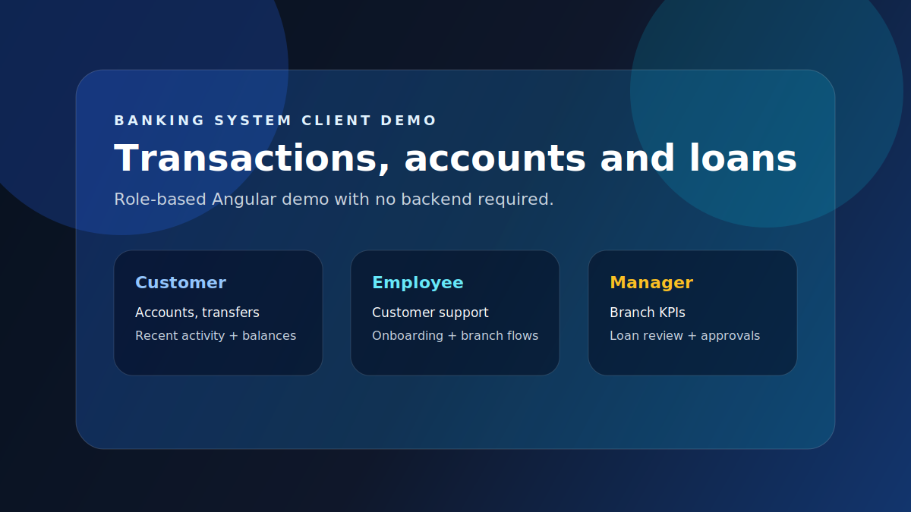

# Banking System

Frontend-only Angular demo for a banking operations platform covering transactions, accounts, customer service, branch management, and loan approvals.

**Live demo:** [banking-system-nine-sooty.vercel.app](https://banking-system-nine-sooty.vercel.app/)

## Demo



No credentials required — use the role buttons on the sign-in page to explore all three dashboards instantly.

## Branches

| Branch | Description |
|---|---|
| `frontend-demo` _(this branch)_ | Frontend-only Angular demo — deployed on Vercel, no backend required |
| `main` | Full-stack source — Node.js/Express backend + Angular frontend |

## Role dashboards

| Role | What you can explore |
|---|---|
| **Customer** | Account balances, account switching, fund transfers, transaction history |
| **Employee** | Customer directory, customer registration, withdrawals, manual loan processing |
| **Manager** | Branch KPI summary, transactions overview, overdue installments, employee list, loan approvals |

Click any row in a transaction, customer, or loan table to open a detail modal.

## Local Development

```bash
npm install
npm start
```

Open `http://localhost:4200`. No backend needed — all data is seeded mock data.

## Deploy on Vercel

Set **Production Branch** to `frontend-demo`.

```text
Framework:         Angular
Build Command:     npm run vercel-build
Output Directory:  dist/banking-system
Root Directory:    (leave blank — project root)
```

`vercel.json` at the root already configures the SPA rewrite.

## Tech stack

Angular · TypeScript · Tailwind CSS · Bootstrap · SweetAlert2
