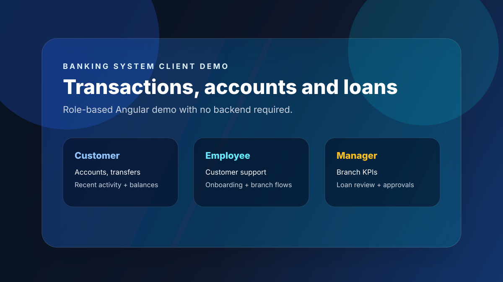

# Banking System

Frontend-only Angular demo for a banking operations platform covering transactions, accounts, customer service, branch management, and loan approvals.

**Live demo:** [banking-system-nine-sooty.vercel.app](https://banking-system-nine-sooty.vercel.app/)

## Demo



No credentials required — use the role buttons on the welcome or sign-in page to explore all three dashboards instantly.

## Highlights

A polished, accessible single-page banking experience:

- **Command palette** — press <kbd>Ctrl</kbd>/<kbd>⌘</kbd> + <kbd>K</kbd> to jump to any page or run quick actions; press <kbd>?</kbd> anywhere for the keyboard-shortcuts sheet. Both are reachable by touch on mobile.
- **Light / dark theme** — applied before first paint (no flash), persisted, honoured by every chart, and by the boot splash itself.
- **Printable documents** — transaction receipts, loan agreements, and FD certificates print as clean documents; a real print stylesheet strips the app chrome from any page.
- **Forms that explain themselves** — every form in the app validates inline on blur, marks the offending field with `aria` wiring, and moves focus to the first problem on submit. Caps-lock warnings on password fields; past dates blocked on schedulers; known payees offered as one-tap quick-fill chips.
- **Sortable, searchable tables** — consistent three-state column sorting with `aria-sort` announcements across customer, employee, and manager screens; skeleton loaders hold the layout while data lands.
- **Data visualisation** — Chart.js doughnut, line, and bar charts that rebuild on theme change.
- **Resilient by design** — the demo works even where the browser blocks `localStorage` (in-memory session fallback), seed data is date-rebased so it always reads as current, and session expiry explains itself instead of silently redirecting.
- **Accessibility** — axe-verified on every route in both themes, on desktop and mobile viewports; focus-trapped dialogs that return focus to their opener; full `prefers-reduced-motion` support.

## Branches

| Branch | Description |
|---|---|
| `frontend-demo` _(this branch)_ | Frontend-only Angular demo — deployed on Vercel, no backend required |
| `main` | Full-stack source — Node.js/Express backend + Angular frontend |

## Role dashboards

| Role | What you can explore |
|---|---|
| **Customer** | Account balances & switching, fund transfers, transaction history, debit/credit cards, recurring standing orders, fixed deposits, FD-backed loans, profile & security settings |
| **Employee** | Customer 360 directory, customer registration, cash deposits & withdrawals, cheque clearing, manual loan processing, service requests, personal performance metrics |
| **Manager** | Branch KPI summary, analytics & reports, loan approvals, employee management & leaderboard, product configuration, announcements, audit log |

Click any row in a transaction, customer, or loan table to open a detail modal.

## Local Development

```bash
npm install
npm start
```

Open `http://localhost:4200`. No backend needed — all data is seeded mock data.

## Testing

### Unit tests (Karma + Jasmine)

1,500+ unit tests cover component logic, form validation, transaction/loan/FD
flows, and shared utilities.

```bash
npm test                                              # watch mode
npm test -- --watch=false --browsers=ChromeHeadless   # single CI run
```

### End-to-end tests (Playwright)

110+ end-to-end tests use **Playwright**, driving a real Chromium browser
against the demo build in two projects — Desktop Chrome and a Pixel 7 mobile
viewport. Because the demo authenticates client-side, the suite covers the
sign-in screen, all three role dashboards, printing, accessibility (axe-core),
performance guards, and even a browser that blocks storage entirely — with no
backend, and it runs green against the Vercel preview too.

```bash
npm install
npx playwright install chromium
npm run build:prod      # produces dist/banking-system
npm run test:e2e        # serves the build with SPA fallback and runs the suite
# Run against a deployed preview instead:
E2E_BASE_URL=https://banking-system-nine-sooty.vercel.app npm run test:e2e
```

## Deploy on Vercel

Set **Production Branch** to `frontend-demo`.

```text
Framework:         Angular
Build Command:     npm run vercel-build
Output Directory:  dist/banking-system
Root Directory:    (leave blank — project root)
```

`vercel.json` at the root already configures the SPA rewrite.

## Tech stack

Angular 21 · TypeScript · Tailwind CSS · Chart.js · SweetAlert2 · Karma/Jasmine · Playwright · axe-core
